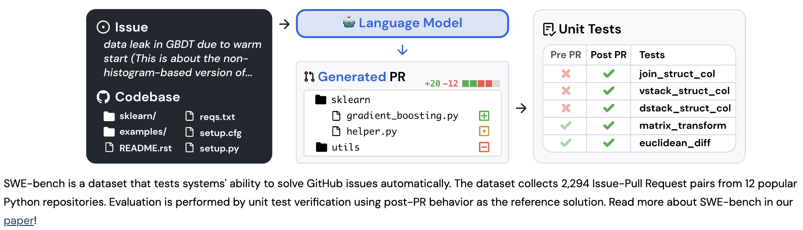
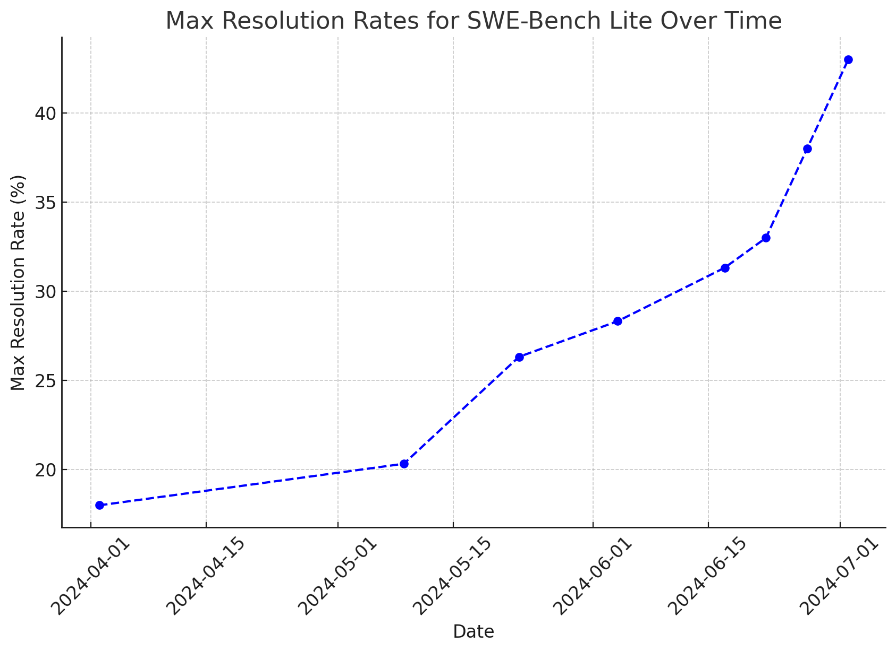
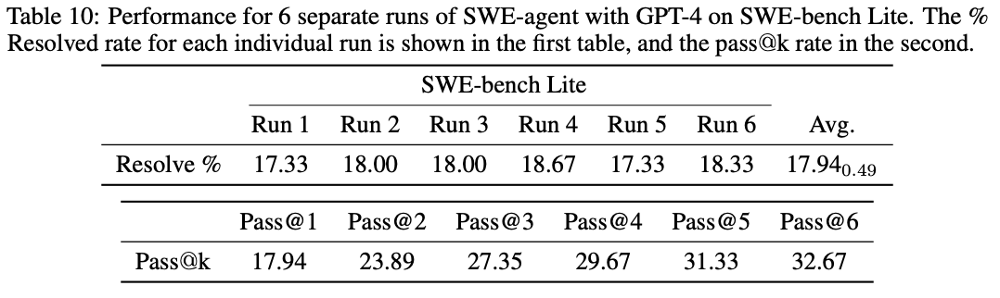

> Cet article fait suite à la présentation du même titre **Ultimate Software Crafter** que nous (Naji Alazhar et Wassel Alazhar) avons donnée le 25 juin 2024 au Meetup Crafting Data Science. [Cette présentation](https://speakerdeck.com/jcraftsman/the-ultimate-software-crafter-meetup-crafting-data-science) traîte de l'état de l'art des agents autonomes de développement logiciel et de leur fonctionnement.



**"Ultimate Software Crafter"**—un titre qui résonne avec une touche de provocation. L'artisanat logiciel serait-il en voie de disparition ?

Depuis des années, les développeurs s'efforcent de rehausser les standards de leur métier, en cherchant constamment à allier excellence technique et professionnalisme. Aujourd'hui, avec l'émergence des agents autonomes de codage, une question se pose : ces nouvelles technologies menacent-elles cette quête d'amélioration continue, ou représentent-elles une opportunité inédite ? Avec ces technologies capables de générer du code de manière autonome, quel est encore le rôle du développeur dans la création logicielle ?

Cet article se propose de démystifier ces agents, de décortiquer leur fonctionnement et de réfléchir à leur impact potentiel sur notre métier.

Nous explorerons également comment des techniques éprouvées, comme le Test-Driven Development (TDD), peuvent être appliquées à ces agents pour transformer le développement logiciel automatisé.

Suivez-nous dans cette exploration où l'avenir du métier se dessine.

## Un Sujet Brûlant

L'agitation autour des agents autonomes de codage est palpable. Les annonces se succèdent, alimentées par des promesses parfois démesurées. [Devin](https://x.com/cognition_labs/status/1767548763134964000), par exemple, s'est fait connaître comme le "premier ingénieur logiciel IA", mais a rapidement [sombré dans la controverse](https://x.com/GergelyOrosz/status/1779035184978866332).

Les attentes étaient énormes, mais les résultats bien en deçà. D'autres, comme [GitHub Copilot Workspace](https://x.com/github/status/1785006787755721210), n'ont pas échappé au même sort, accumulant [les démos ratées](https://www.youtube.com/watch?v=75Hv0RUFIrQ) qui laissent le public sceptique. Ces agents sont encore en phase de développement, loin d'être prêts pour une adoption massive. On nous parle d'une révolution imminente, mais jusqu'à il n'y a pas très longtemps, seuls des produits fermés et des listes d'attente étaient disponibles.

Heureusement, des alternatives open-source commencent à voir le jour, offrant un peu plus de transparence et de compréhension. Parmi elles, [SWE-Agent](https://github.com/princeton-nlp/SWE-agent) se distingue, montrant que tout n'est pas qu'une question de marketing. Mais la tendance actuelle ne va pas s'atténuer de sitôt (avec [des modèles LLMs plus performant dans la génération de code](https://x.com/alexalbert__/status/1803804677701869748) et de plus en plus d'[alternatives open-sources avec des approches plus crédibles](https://www.tiktok.com/@steve8708/video/7382315491341126955)). Les débats autour de ces technologies, entre espoir et désillusion, continuent d'alimenter la conversation. Dans ce contexte bouillonnant, il devient crucial de démêler le vrai du faux et d'explorer ce dont ces agents sont vraiment capables.

<!-- markdownlint-disable MD033 -->

  

    <blockquote class="twitter-tweet" data-dnt="true">
      

        Today we&#39;re excited to introduce Devin, the first AI software engineer.  
        Devin is the new state-of-the-art on the SWE-Bench coding benchmark, has successfully passed practical engineering interviews from leading AI companies, and has even completed real jobs on Upwork… <a href="https://t.co/ladBicxEat">pic.twitter.com/ladBicxEat</a>
      

      &mdash; Cognition (@cognition_labs)
      <a href="https://twitter.com/cognition_labs/status/1767548763134964000?ref_src=twsrc%5Etfw">March 12, 2024</a>
    </blockquote>
    
  

  

    <blockquote class="twitter-tweet">
      

        Devin (named “the world’s first AI engineer” from the start) and looked to me it’s far more marketing and hype than reality.  
        But even I didn’t assume how their own staged video would blatantly lie. It does. A software engineer looked closer. Damning:
        <a href="https://t.co/iKu8yfuFbA">https://t.co/iKu8yfuFbA</a>
      

      &mdash; Gergely Orosz (@GergelyOrosz)
      <a href="https://twitter.com/GergelyOrosz/status/1779035184978866332?ref_src=twsrc%5Etfw">April 13, 2024</a>
    </blockquote>
    
  

<!-- markdownlint-enable MD033 -->

Nous entrerons maintenant dans le vif du sujet en analysant les capacités actuelles des agents de codage autonomes. Que peuvent-ils réellement accomplir ?

## Quelles sont les capacités actuelles des agents de codage ? État de l'art

Quand nous parlons d'agent autonome de codage, nous faisons référence à un programme capable de résoudre une tâche en toute autonomie et de soumettre une Pull Request (PR) à partir d'une demande de changement (issue, tâche, ou User Story) fournie sous forme de texte ou provenant d'un outil de gestion comme GitHub Issues, Jira, ou Notion.

Répondre à la question "Quelles sont les capacités actuelles des agents de codage ?" est cependant complexe pour plusieurs raisons. Les performances de ces agents varient considérablement en fonction des tâches, des environnements, et des modèles sous-jacents utilisés. De plus, les benchmarks et les études montrent des résultats en constante évolution, rendant difficile une évaluation stable. Enfin, les contextes d'application, les types de problèmes résolus et la manière dont ces agents sont intégrés aux processus existants influencent également leurs capacités réelles.

Pour tenter de répondre à cette question, nous nous appuyons sur deux études récentes qui, malgré quelques limites et biais, restent parmi les sources les plus sérieuses disponibles :

1. **SWE-Agent: Agent-Computer Interfaces Enable Automated Software Engineering** ([Lire sur arXiv](https://arxiv.org/abs/2405.15793))
2. **SWE-bench: Can Language Models Resolve Real-World GitHub Issues?** ([Lire sur arXiv](https://arxiv.org/abs/2310.06770))

### Benchmarking et résultats

SWE-bench est une référence pour évaluer les performances des agents de codage. Le protocole est rigoureux : l'agent reçoit le commit parent d'une PR résolue et doit proposer une nouvelle PR qui sera validée en exécutant tous les tests associés. Ce processus permet de vérifier la capacité de l'agent à résoudre les problèmes de manière autonome, sans engendrer de régressions.

**SWE-bench Full :** Ce dataset contient 2294 tâches à résoudre (GitHub issues) sélectionées depuis 12 des dépôts GitHub python les plus populaires (Django, flask, matplotlib, requests, scikit learn, sympy…). Les repos ciblés répondaient aux critères suivants : des guidelines de contrinutions claires, une bonne couverture de tests, globalement bien maintenu (avec des commits réguliers).

**SWE-bench Lite** est un dataset allégé, conçu pour se concentrer sur des issues plus ciblées et éliminer les variables qui pourraient biaiser les résultats. Cette version exclut, entre autres, les issues avec des dépendances externes ou des images, celles dont la description est trop courte (moins de 40 mots), ainsi que les PR touchant à plusieurs fichiers. Avec 300 issues sélectionnées pour leur clarté et leur maintenabilité, SWE-bench Lite fournit un cadre plus précis (et surtout plus économique) pour évaluer la performance des agents dans un environnement contrôlé.

Les résultats obtenus peuvent impressionner, mais ils doivent être interprétés avec précaution. L'évolution rapide des performances, comme illustré dans le graphique ci-dessus, montre une amélioration continue des taux de résolution. Cependant, tous les résultats ne sont pas toujours comparables. Par exemple, AutoCodeRover avec GPT-4 a atteint 19 % de réussite, mais cela inclut trois exécutions distinctes (Pass@3) et le temps de résolution est bien plus lent que d'autres agents.

Dans cet environnement de données souvent complexes, nous recommandons de se concentrer sur des résultats transparents et vérifiés, notamment ceux obtenus en open-source, avec une seule exécution (Pass@1). À ce jour, ces taux atteignent 18,13 % pour le benchmark standard et 26,67 % pour SWE-bench Lite.

> OpenAI s'est également intéressé à ce domaine, proposant [SWE-bench Verified](https://openai.com/index/introducing-swe-bench-verified/), un ensemble de 500 problèmes validés par des ingénieurs logiciels, offrant ainsi un cadre d'évaluation encore plus rigoureux.

### Limitations et Opportunités

#### Limitations

Les agents actuels montrent des lacunes lorsqu'ils doivent traiter des issues nécessitant peu de modifications ou lorsque les descriptions sont trop concises. De plus, notre analyse se concentre uniquement sur la phase allant de l'issue à la PR, excluant ainsi :

- Le travail après la PR (revue, tests, déploiement, monitoring…)
- Le travail avant l'issue (discussions, formulation des besoins…)

Et c'est d'ailleus pour cette raison que nous préférons parler d'agents autonomes de codage plutôt que d'agents autonomes de développement.

#### Opportunités

Malgré ces limitations, les agents autonomes présentent un potentiel économique intéressant.

Si l'on se met dans la peau d'un manager, et que l'on décide de quantifier le gains que l'on pourrait réaliser en utilisant ces agents, on pourrait arriver à des chiffres impressionnants :

- **L'équivalent de 149,58 jours-homme de code pour 600 $**, contre 75 000 $ en méthode traditionnelle.

Pour arriver à ce chiffre, nous avons pris en compte les hypothèses suivantes :

- On intégre un agent autonome de codage (GPT-4o) dans le processus de développement avec un taux de résolution de 18%.
- On tente systématiquement de résoudre chaque issue 1 fois (1 seule execution = Pass@1).
- Coût :
  - < 2 $ par issue (API GPT-4o) + infrastructure d'exécution.
  - Cout total : 600 $ pour 300 issues.
- Résultats :
  - 54 issues résolues sur 300, soit l'équivalent de 149,58 jours-homme de codage qui ont été automatisés. (*[Une étude](https://arxiv.org/pdf/2404.05427) à montré que les développeurs mettent en moyenne 2,77 jours pour résoudre une issue faisant partie du SWE-Bench-Lite dataset*).
  - Coût moyen de l'équivalent jour-homme automatisé : 4,01 $.
  - Durée de résolution moyenne par issue par l'agent: 2 à 10 min.

> It costs on average ~2.77 days for developers to create pull requests… [samples from SWE-Bench-Lite dataset]
>
> Source: “AutoCodeRover: Autonomous Program Improvement” paper. <https://arxiv.org/pdf/2404.05427>

Ces résultats peuvent être bien plus impressionnants si l'on considère des agents plus performants. Par exemple, Moatless Tools avec Claude 3.5 Sonnet a atteint 26,67 % de réussite sur SWE-bench Lite, ce qui pourrait se traduire par :

- **221,63 jours-homme pour 50 $**, contre 111 000 $ en méthode traditionnelle.

### Potentiel d'amélioration

#### Exécutions multiples

Les taux de réussite peuvent être améliorés en multipliant les tentatives. Comme le montre le Pass@k, plusieurs exécutions d'une même issue peuvent significativement augmenter les performances globales.

Il est vrai que cette approche peut poser des défis techniques et nécessiter une gestion complexe des ressources, surtout en ce qui concerne le temps de calcul et les infrastructures nécessaires pour supporter plusieurs exécutions simultanées. Cependant, elle reste une piste à explorer pour améliorer les performances des agents. Et même si elle paraît coûteuse, le potentiel d'économie reste très intéressant.

#### Amélioration de la qualité du feedback

Un autre levier d'amélioration réside dans la qualité du feedback fourni à l'agent pendant la résolution des issues. En intégrant une approche "test-first", nous pensons que ces taux de réussite pourraient encore augmenter. Le feedback en continu permettrait à l'agent de corriger ses erreurs plus efficacement, améliorant ainsi la qualité et la pertinence des PR générées.

### On automatise tout ? Pas si vite

Les capacités actuelles des agents de codage ouvrent de nouvelles perspectives pour l'automatisation de l'ingénierie logicielle, mais elles soulèvent aussi des questions sur la manière dont ces technologies s'intègrent dans nos pratiques existantes. Pour approfondir notre exploration, nous allons maintenant examiner comment ces agents fonctionnent en détail et comment ils peuvent être optimisés pour un impact maximal.

Néanmoins, nous tenons à souligner que le calcul de l'économie réalisée par l'utilisation de ces agents est une simplification. En effet, il ne prend pas en compte les coûts indirects, tels que la qualité du code généré, la maintenance, la régression, la sécurité, etc. Ces coûts indirects peuvent être significatifs et doivent être pris en compte dans toute évaluation sérieuse.
